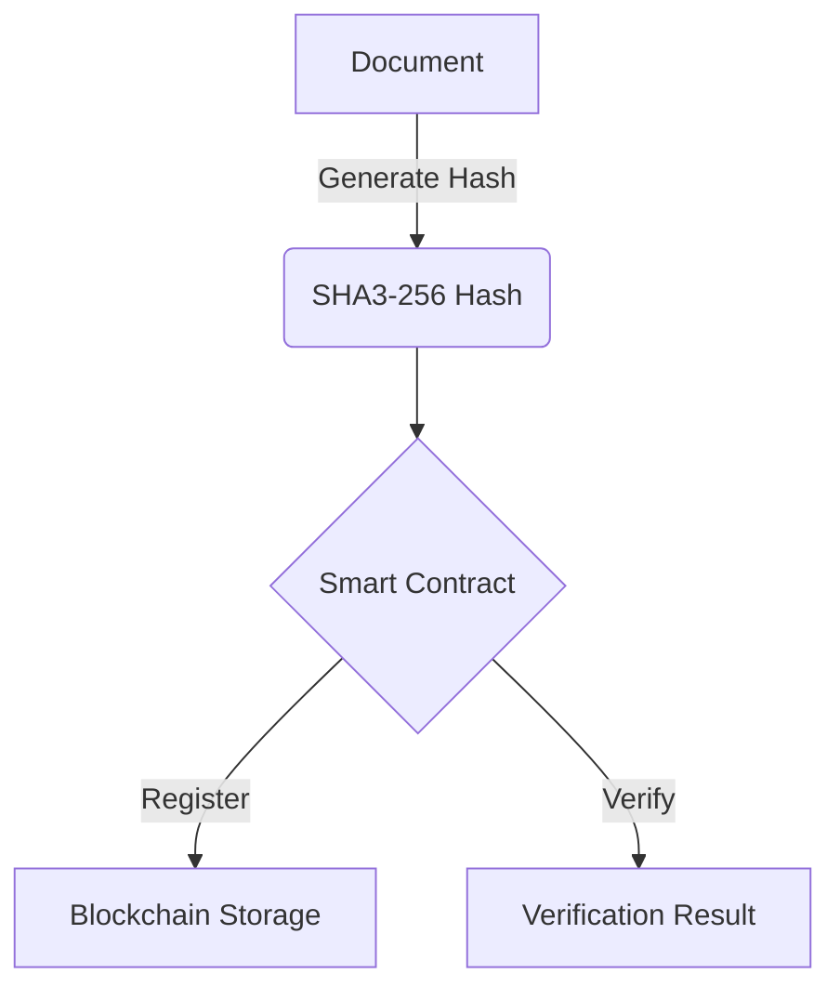
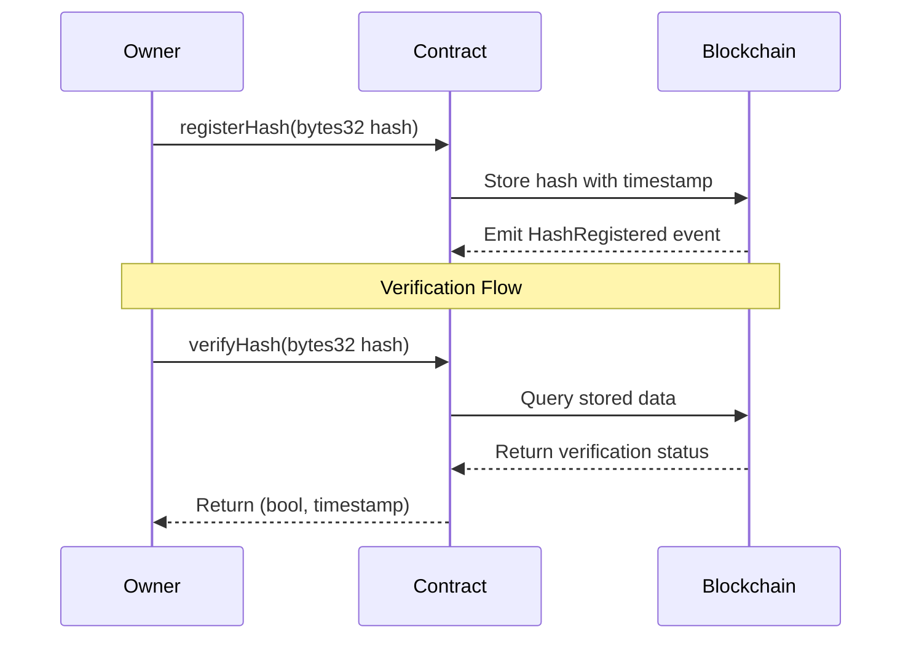

# VerifiedDoc 🔐

A blockchain-based document verification system that allows authorized parties to register and verify document hashes on the Ethereum network.

## 📋 Overview

VerifiedDoc is a smart contract solution that provides:

- Secure document hash registration
- Immutable timestamp verification 
- Owner-controlled access
- Transparent verification process
- Audit trail through blockchain events

## 🏗 Architecture



## ⚙️ How It Works



## ✨ Features

- **Hash Registration**: Only the contract owner can register document hashes
- **Verification**: Anyone can verify if a document hash exists
- **Timestamp Tracking**: Each registered hash includes its registration timestamp
- **Event Logging**: Emits events for all registrations for audit trails
- **Gas Optimized**: Efficient storage and operations to minimize transaction costs

## 🚀 Contract Deployment

### Sepolia Testnet
- **Contract Address**: `0x4B561994954f77C4A8AE298CbD52F88444ac59F4`
- **Deployer**: `0xD0749739d20048f4977F83c847be9a19230dEB3d`
- **Transaction**: [`0xf8928a79fa4cdd80110797b9190fb319fdd92e4cdfc8a4af931970adfac029c1`](https://sepolia.etherscan.io/tx/0xf8928a79fa4cdd80110797b9190fb319fdd92e4cdfc8a4af931970adfac029c1)
- **Verified Contract**: [View on Etherscan](https://sepolia.etherscan.io/address/0x4B561994954f77C4A8AE298CbD52F88444ac59F4#code)

### zkSync Deployment
```bash
# Deploy contract
forge create VerifiedDocContracts --zksync --rpc-url http://0.0.0.0:8011 --private-key 0xac0974bec39a17e36ba4a6b4d238ff944bacb478cbed5efcae784d7bf4f2ff80

# Deployment Result
✅ Hash: 0x1889f9770eeb1b49d7f5d9c57bc6bfc920fc87ea1b7ff9039577e24bc55c9996
Initiator: 0xf39fd6e51aad88f6f4ce6ab8827279cfffb92266
Payer: 0xf39fd6e51aad88f6f4ce6ab8827279cfffb92266
Gas Used: 4,750,722 / 15,300,418
Cost: 0.0002149702 ETH

# Register hash example
cast send 0x4B561994954f77C4A8AE298CbD52F88444ac59F4 "registerHash(bytes32)" 0x64e604787cbf194841e7b68d7cd28786f6c9a0a3ab9f8b0a0e87cb4387ab0107 --rpc-url http://0.0.0.0:8011 --private-key 0xac0974bec39a17e36ba4a6b4d238ff944bacb478cbed5efcae784d7bf4f2ff80

# Registration Result
✅ Hash: 0xe547989e3a9d16c44a2d0dc83b222f71a4c5ca285af35a4fec25a03545df6f63
Gas Used: 145,518 / 205,301
Cost: 0.0000065847 ETH
```

## 🛠 Development

### Prerequisites

- [Foundry](https://book.getfoundry.sh/getting-started/installation) (v0.2.0 or later)
- Ethereum wallet with Sepolia ETH
- [Node.js](https://nodejs.org/) (v16 or later)
- [Git](https://git-scm.com/downloads) (v2.30 or later)

### Installation

```bash
git clone https://github.com/vedantnn71/VerifiedDoc.git
cd VerifiedDoc
forge install
```

### Testing

```bash
# Run all tests
forge test

# Run tests with verbose output
forge test -vv

# Run specific test
forge test --match-test testRegisterHash
```

### Deployment

```bash
# Set environment variables
export RPC_URL="https://sepolia.infura.io/v3/YOUR_INFURA_KEY"

# Deploy contract
forge script script/VerifiedDocContracts.s.sol:VerifiedDocScript \
    --rpc-url $RPC_URL \
    --interactive \
    --broadcast \
    --verify

# Verify contract (if not done during deployment)
forge verify-contract $CONTRACT_ADDRESS \
    src/VerifiedDoc.sol:VerifiedDoc \
    --chain sepolia \
    --etherscan-api-key $ETHERSCAN_API_KEY
```

## 📖 Usage

### Generating Document Hash

```javascript
// Example in JavaScript
const { createHash } = require('crypto');
const fs = require('fs');

function generateDocumentHash(filePath) {
  const fileBuffer = fs.readFileSync(filePath);
  const hash = createHash('sha256').update(fileBuffer).digest('hex');
  return "0x" + hash;
}

const docHash = generateDocumentHash('path/to/document.pdf');
console.log("Document Hash:", docHash);
```

### Interacting with Contract

```solidity
// Register a hash (owner only)
function registerDocumentHash(bytes32 hash) public onlyOwner {
    // Call contract's registerHash function
}

// Verify a hash (public)
function verifyDocumentHash(bytes32 hash) public view returns (bool exists, uint256 timestamp) {
    // Call contract's verifyHash function
}
```

## ⚠️ Error Handling

The contract includes three custom errors:
- `NotOwner`: Thrown when non-owner tries to register a hash
- `HashAlreadyRegistered`: Thrown when registering an existing hash
- `HashNotFound`: Thrown when verifying a non-existent hash

## 🔒 Security Considerations

- Only the contract owner can register new hashes
- Hashes are stored using a bytes32 format for maximum security
- Contract is immutable after deployment
- Uses latest Solidity version (^0.8.13) for built-in overflow protection
- No external contract dependencies to minimize attack surface
- Thoroughly tested against common attack vectors

## 🤝 Contributing

Contributions are welcome! Please follow these steps:

1. Fork the repository
2. Create your feature branch (`git checkout -b feature/amazing-feature`)
3. Commit your changes (`git commit -m 'Add some amazing feature'`)
4. Push to the branch (`git push origin feature/amazing-feature`)
5. Open a Pull Request

## 📄 License

This project is licensed under the MIT License.
